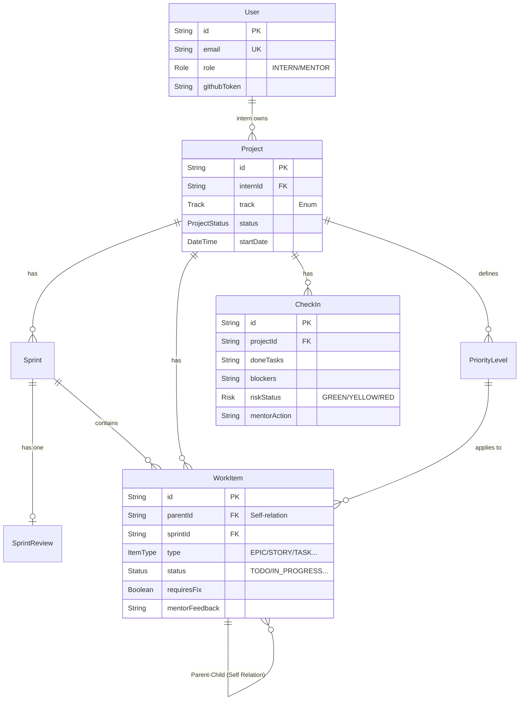

# 02. Thiết kế Cơ sở Dữ liệu (Database Schema)

## Tổng quan
AIMS sử dụng CSDL quan hệ **PostgreSQL** và được định nghĩa bằng **Prisma ORM**. Mô hình dữ liệu được tối ưu hóa cho quản trị luồng Agile với cấu trúc cây phân cấp (Hierarchical Tree) cho Backlog.

## Entity Relationship Diagram (ERD)
Dưới đây là sơ đồ thực thể chính của hệ thống.

## Giải phẫu Các Mối quan hệ Quan trọng

### 1. Quan hệ Phân cấp Công việc (WorkItem Hierarchy)
**`WorkItem`** là bảng cốt lõi và phức tạp nhất. Nó sử dụng Self-Relation (`parentId` tham chiếu đến chính `id` của `WorkItem`) để xây dựng cấu trúc cây:
- `EPIC` -> `STORY` -> `TASK`
Nhờ cấu trúc này, ta có thể dễ dàng truy vấn toàn bộ Task con của một Epic chỉ bằng đệ quy hoặc Prisma `include`.

### 2. Sự Độc lập của Backlog
Cột `sprintId` trong `WorkItem` là tùy chọn (`?`).
- Khi `sprintId == null`, công việc đó nằm ở Product Backlog.
- Khi `sprintId != null`, công việc đó đã được lôi vào một Sprint Backlog để thực thi.

### 3. Vòng lặp Feedback và Kiểm soát Rủi ro
- Bảng `CheckIn` lưu lại tình trạng sức khỏe dự án hàng ngày. Thay vì tạo bảng Comment riêng, trường `mentorAction` được gắn thẳng vào dòng Check-in đó để Mentor gỡ nút thắt trực tiếp.
- Bảng `SprintReview` có mối quan hệ `1-1` với `Sprint`. Mỗi Sprint khi đóng lại chỉ có duy nhất 1 biên bản Review. Tương tự, nó chứa `mentorFeedback` để chấm điểm.

## Lợi ích của thiết kế này
- **Tra cứu tốc độ cao:** Việc nhúng (embedding) trực tiếp các trường feedback vào trong các bảng chính (`WorkItem`, `CheckIn`) thay vì tách ra bảng riêng giúp truy vấn (Join) giảm đi đáng kể, đẩy nhanh tốc độ tải trang.
- **Tính nhất quán dữ liệu:** Việc sử dụng các kiểu `Enum` (Role, Status, Risk, Track) ở cấp độ Database đảm bảo tính toàn vẹn (Data Integrity) dù Client có gửi request sai định dạng.
