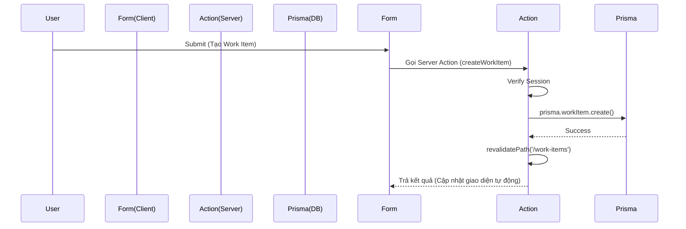

# 03. Luồng Dữ liệu và API (API & Data Flow)

## Tổng quan
AIMS được thiết kế cực kỳ hiện đại nhờ sử dụng tối đa Server Components và Server Actions của Next.js 14. Sự phân cực rõ ràng này loại bỏ được Redux, Axios, và Fetch boilerplate phức tạp ở Client.

## Chiến lược Lấy Dữ liệu (Data Fetching Strategy)

### 1. Server Components làm trọng tâm (Default Fetching)
Bất kỳ khi nào có thể, dữ liệu được kéo trực tiếp từ PostgreSQL thông qua Prisma ở phía Server Component (`page.tsx` hoặc `layout.tsx`).
- **Ưu điểm:** Loại bỏ độ trễ do round-trip network. Dữ liệu trả về Client là HTML đã có sẵn nội dung (tốt cho tốc độ render FCP).
- **Cách thức:** Hàm `async` trực tiếp gọi `await prisma.model.findMany()`.
- **Ví dụ:** Lấy danh sách Sprints ở `/dashboard/[projectId]/sprints/page.tsx` là hoàn toàn diễn ra trên Server.

### 2. Truyền dữ liệu cho Client Components
Khi cần vẽ biểu đồ (VD: `Recharts` trong `InternCharts.tsx`) hoặc làm Form có tính tương tác, Server Component sẽ đóng vai trò **Data Provider**. Nó fetch Data trên server rồi truyền (pass props) vào Client Component.

## Luồng Thay đổi Dữ liệu (Data Mutation Flow)

AIMS không dùng API Routes `/api/...` để xử lý POST/PUT/DELETE. Tất cả đi qua **Server Actions** đặt tại `src/app/actions.ts` hoặc các module nhỏ gọn.

### Vòng lặp Server Action hoàn chỉnh
1. **Client Interaction:** User nhấn nút "Tạo Sprint" trong Form (`<form action={createSprint}>` hoặc qua hook `useTransition`).
2. **Action Invocation:** Lời gọi được gửi ngầm (RPC) từ Client lên Next.js Server.
3. **Authentication Guard:** Trong hàm Server Action, dòng đầu tiên luôn là `getServerSession(authOptions)` để chặn ngay request nếu user mạo danh.
4. **Prisma Mutation:** Gọi `prisma.sprint.create({...})` để ghi xuống DB.
5. **Revalidation:** Cực kỳ quan trọng! Server Action gọi `revalidatePath('/dashboard/[projectId]/sprints')` để yêu cầu Next.js xóa cache của trang đó.
6. **UI Update:** Next.js tự động gửi HTML/Dữ liệu mới về Client, giao diện tự động cập nhật mà không cần hàm `setState()` hay `fetch()` nào.

## Quản lý Lỗi (Error Handling)
Các Action thường trả về kết quả dưới dạng Object `{ success: boolean, message: string, data?: any }`.
Ở phía Client, sử dụng `react-hot-toast` hoặc trạng thái React (`useActionState` / `useFormStatus`) để hiển thị lỗi cho người dùng một cách mềm mại (Graceful Degradation).
