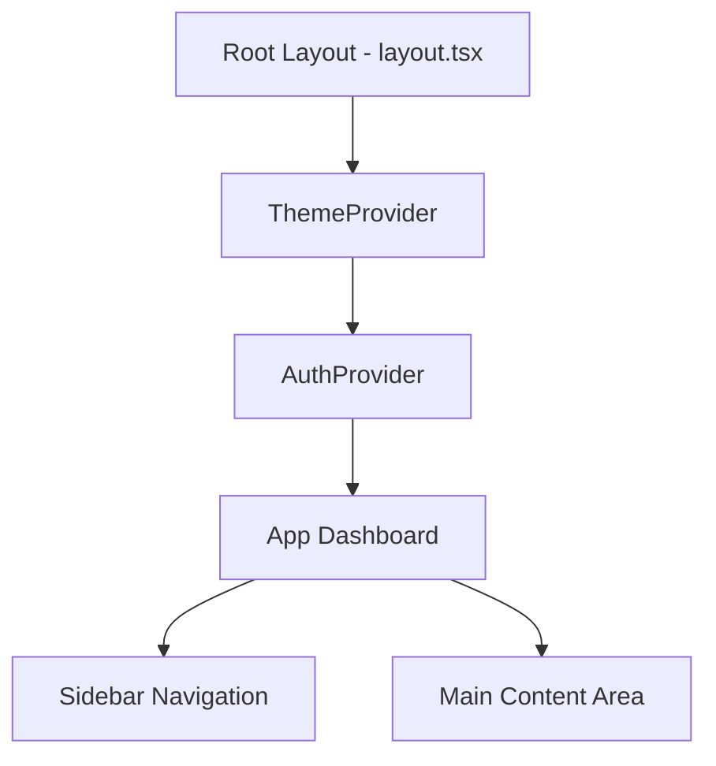

# 04. Hệ thống Giao diện UI/UX (Design System)

## Tổng quan
AIMS được thiết kế với triết lý giao diện Sạch (Clean UI), Tối giản (Minimalism) và cực kỳ mượt mà. Hệ thống tận dụng Tailwind CSS v4 mới nhất để loại bỏ các cấu hình cồng kềnh, ưu tiên hiệu suất cao.

## Công nghệ sử dụng
- **Styling Framework:** Tailwind CSS v4 (Sử dụng `@theme` trực tiếp trong `globals.css`).
- **Typography:** Google Font `Inter` - Font chữ tiêu chuẩn của các ứng dụng SaaS hiện đại, dễ đọc, khoảng cách chữ hoàn hảo.
- **Biểu đồ:** Recharts - Thư viện biểu đồ nhẹ, tương thích SSR.
- **Iconography:** (Tùy chọn) Lucide React hoặc Heroicons cho các biểu tượng chức năng.

## Triết lý Thiết kế (Design Principles)
### 1. Dark Mode Mặc định / Tùy chỉnh (Dark/Light Mode)
AIMS hỗ trợ Dark Mode First-class:
- **Anti-flash Script:** Trong file `layout.tsx` chứa một script chạy trần (vanilla JS) trên thẻ `<head>` để kiểm tra `localStorage` và `prefers-color-scheme`. Điều này giúp ứng dụng không bị lóe sáng (flash) khi người dùng mở trang ở chế độ Dark Mode.
- **Biến CSS Tailwind:** Toàn bộ màu sắc đều sử dụng hệ thống màu động. VD: `bg-white dark:bg-[#171717]`. Mã màu Dark Mode được chọn lựa tinh tế (các tone xám sẫm trung tính `#171717`, `#0A0A0A` thay vì màu đen tuyền `#000000`).

### 2. Glassmorphism & Depth
- Ứng dụng tận dụng các bóng đổ tinh tế (`shadow-sm`) ở Light Mode và viền (`border-[#383838]`) ở Dark Mode để phân tách không gian.
- Hiệu ứng làm mờ nền (backdrop-blur) ở thanh Sidebar hay Navigation bar giúp mang lại cảm giác có chiều sâu (Depth).

### 3. Tương tác mượt mà (Micro-interactions)
- Mọi thao tác như hover button, hiển thị Modal đều được gắn class `transition-all duration-300` hoặc `animate-in fade-in`. 
- Sự phản hồi ngay lập tức về mặt thị giác (Visual Feedback) giảm bớt cảm giác "chờ đợi" khi ứng dụng xử lý dữ liệu.

## Cấu trúc Layout

- Thanh Sidebar cố định (Fixed Sidebar) chứa các liên kết chuyển hướng nhanh.
- Khu vực nội dung chính có thanh cuộn độc lập, giúp trải nghiệm trên máy tính (Desktop) mang cảm giác của một ứng dụng thực thụ (App-like experience) thay vì một trang web đơn thuần.
