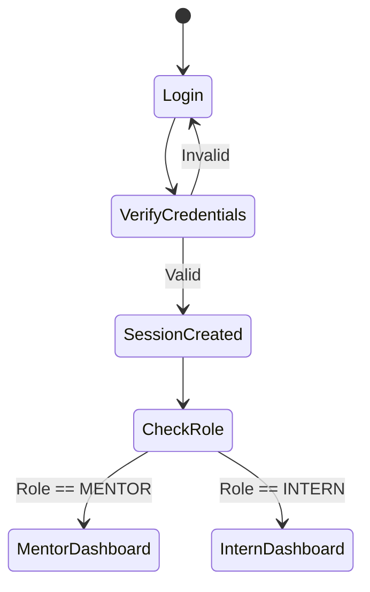

# 01. Authentication & Role-Based Access Control (RBAC)

## Tổng quan
Hệ thống AIMS sử dụng **NextAuth.js** kết hợp với **Prisma Adapter** để xử lý luồng đăng nhập và quản lý phiên làm việc (Session). Xác thực tập trung vào việc định danh người dùng và điều hướng họ đến đúng không gian làm việc dựa trên vai trò (Role).

## Mô hình Dữ liệu (Data Model)
Bảng `User` lưu trữ các thông tin bảo mật và định danh:
- `email` (Unique): Định danh đăng nhập.
- `password`: Mật khẩu (đã được mã hóa qua bcrypt).
- `role`: Kiểu enum `Role` (INTERN, MENTOR).
- `githubToken`: Token tùy chọn phục vụ việc kết nối với các kho lưu trữ (tích hợp CI/CD, Git flow sau này).

## Luồng Xác thực (Authentication Flow)
1. Người dùng truy cập `/login`.
2. Gửi thông tin thông qua form (Email, Password).
3. Hệ thống gọi phương thức NextAuth `credentials` để xác minh:
   - So sánh mật khẩu bằng bcrypt.
   - Nạp thông tin Role vào trong Token/Session.
4. Điều hướng (Redirect) dựa trên Role:
   - Nếu là `INTERN`: Chuyển đến `/dashboard` (hiển thị `InternCharts`).
   - Nếu là `MENTOR`: Chuyển đến `/dashboard` (hiển thị `MentorCharts`).

## Bảo vệ Tuyến đường (Route Protection)
Mọi trang nằm trong thư mục `app/dashboard` đều được bảo vệ.
- Các Component Server kiểm tra `getServerSession`. Nếu không có session, redirect về `/login`.
- Cấu trúc thư mục chia cắt rõ rệt: `/app/dashboard/mentor/...` chỉ cho phép Mentor truy cập, các trang `/app/dashboard/interns/...` hoặc quản lý dự án sẽ được giới hạn quyền truy cập dựa trên mối quan hệ sở hữu dự án (`internId` == session.user.id).

## Sơ đồ State Machine (RBAC)

