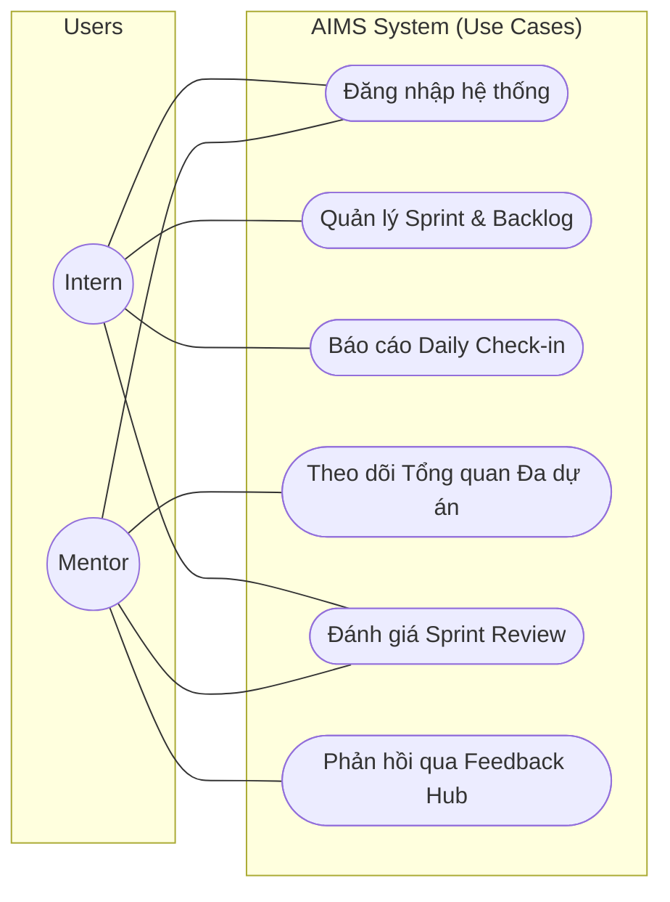
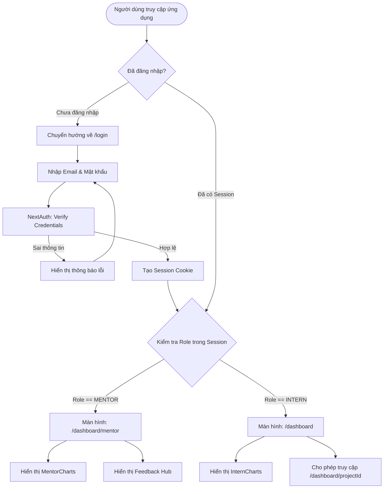

# 01. Authentication & Role-Based Access Control (RBAC)

## Tổng quan
Hệ thống AIMS sử dụng **NextAuth.js** kết hợp với **Prisma Adapter** để xử lý luồng đăng nhập và quản lý phiên làm việc (Session). Xác thực tập trung vào việc định danh người dùng và điều hướng họ đến đúng không gian làm việc dựa trên vai trò (Role).

## Sơ đồ Use Case (Tổng thể Hệ thống)
Biểu đồ dưới đây trình bày bao quát quyền hạn của từng Role đối với các nhóm chức năng chính.

## Lộ trình Xác thực và Điều hướng (Authentication & Redirect Flow)
Lộ trình dưới đây mô tả chính xác từng bước hệ thống xử lý khi một người dùng bất kỳ truy cập vào AIMS, từ khâu kiểm tra xác thực (Middleware/AuthGuard) cho đến khi phân luồng vào đúng Dashboard của từng Role.

## Mô hình Dữ liệu (Data Model)
Bảng `User` lưu trữ các thông tin bảo mật và định danh:
- `email` (Unique): Định danh đăng nhập.
- `password`: Mật khẩu (đã được mã hóa qua bcrypt).
- `role`: Kiểu enum `Role` (INTERN, MENTOR).
- `githubToken`: Token tùy chọn phục vụ việc kết nối với các kho lưu trữ (tích hợp CI/CD, Git flow sau này).

## Bảo vệ Tuyến đường (Route Protection)
Mọi trang nằm trong thư mục `app/dashboard` đều được bảo vệ nghiêm ngặt:
- Các Component Server luôn gọi `getServerSession` ở dòng đầu tiên. Nếu Session rỗng, lập tức trigger lệnh `redirect('/login')`.
- Cấu trúc thư mục chia cắt rõ rệt: Các tuyến `/app/dashboard/mentor/...` sẽ có bước kiểm tra bổ sung `if (session.user.role !== 'MENTOR') return redirect('/dashboard')` để chống việc Intern gõ URL truy cập trái phép vào không gian của Mentor.
