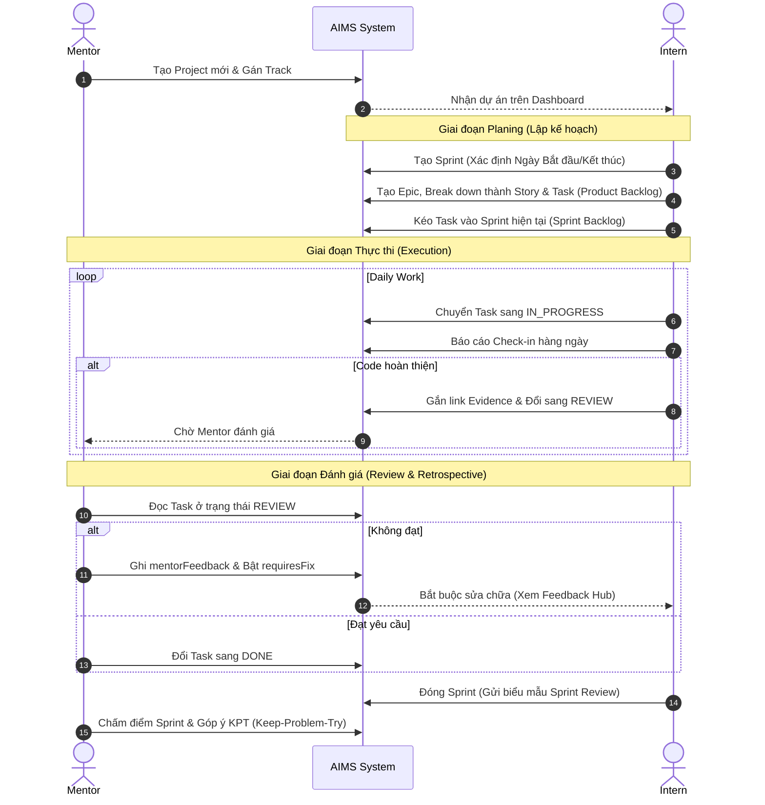

# 02. Quản lý Dự án Agile (Agile Project Management)

## Tổng quan
Trung tâm của hệ thống AIMS là quản lý tiến độ thực tập sinh thông qua các dự án thực tế theo phương pháp Agile/Scrum. Mỗi Intern sẽ sở hữu các `Project` thuộc các `Track` (chuyên ngành) khác nhau, và quản lý công việc trong đó thông qua các Sprints và Work Items (Backlog).

## Lộ trình Quản lý Dự án (Swimlane Flowchart)
Sơ đồ dưới đây phân tách rõ ranh giới hành động giữa Mentor, Intern và Hệ thống trong toàn bộ vòng đời của một dự án Agile.

## Cấu trúc Cốt lõi
### 1. Quản lý Dự án (Projects)
Mỗi dự án (Model `Project`) có:
- **Track:** Lĩnh vực của dự án (VD: SOFTWARE_DEVELOPMENT, DATA_ANALYTICS).
- **Timeframe:** `startDate`, `endDate`.
- **Trạng thái (Status):** ACTIVE, COMPLETED, ON_HOLD, WITHDRAWN.
- **Tích hợp:** URL đến kho lưu trữ mã nguồn `githubRepo`.

### 2. Quản lý Chu kỳ (Sprints)
Dự án được chia thành các vòng lặp nhỏ gọi là Sprint (`/dashboard/[projectId]/sprints`).
- Chức năng: Khởi tạo Sprint mới với thời gian cụ thể (`startDate`, `endDate`).
- Tích hợp Đánh giá: Mỗi Sprint có một `SprintReview` đính kèm để lưu giữ kết quả đánh giá cuối kỳ.

### 3. Cấu trúc Backlog (Work Items)
Backlog của hệ thống sử dụng cấu trúc phân cấp (Hierarchical Tree) phổ biến:
- **Loại Item (`ItemType`):** `EPIC`, `FEATURE`, `STORY`, `TASK`, `BUG`.
- **Luồng Trạng thái (`Status`):**
  - Công việc bắt đầu ở `TODO`.
  - Được gán vào một Sprint (`sprintId`) hoặc nằm ở dạng Backlog thuần (chưa có Sprint).
  - Trạng thái di chuyển: `TODO` -> `IN_PROGRESS` -> `REVIEW` -> `DONE`. Nếu có cản trở, đưa về `BLOCKED`.
- **Mối quan hệ Parent - Child:** Một Epic có thể chứa nhiều Story, một Story chứa nhiều Task. Điều này thể hiện qua self-relation `parentId` và `children`.
