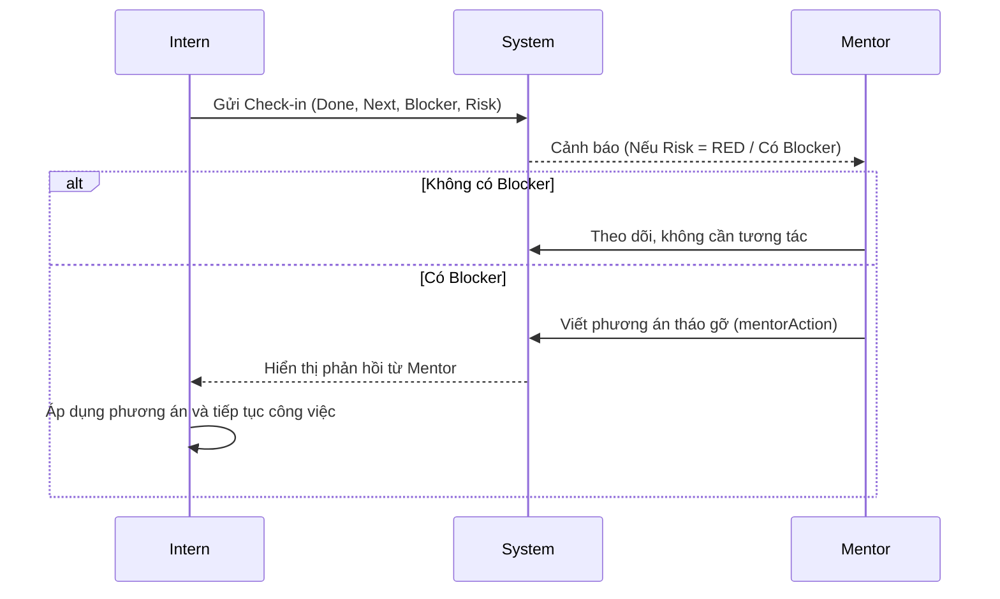

# 03. Hệ thống Báo cáo Hàng ngày (Daily Check-in System)

## Tổng quan
Hệ thống Check-in (hay Daily Stand-up không đồng bộ) giải quyết bài toán quản lý và giao tiếp hàng ngày giữa Mentor và Intern mà không cần phải họp trực tiếp. Điều này đảm bảo tính minh bạch và ghi nhận lịch sử tiến độ liên tục.

## Quy trình Báo cáo (Check-in Flow)
Luồng thao tác mỗi ngày của Intern:
1. **Truy cập dự án:** Vào `/dashboard/[projectId]/check-ins`.
2. **Khai báo thông tin:**
   - Điền **Done Tasks:** Những việc đã làm hôm qua/gần nhất.
   - Điền **Next Tasks:** Những việc định làm hôm nay.
   - Báo cáo **Blockers:** Trình bày khó khăn nếu có.
   - Gắn **Evidence Link:** Link PR (Pull Request) hoặc link Commit minh chứng.
3. **Đánh giá rủi ro (Risk Status):** Tự đánh giá mức độ rủi ro dự án hiện tại bằng 3 màu: `GREEN` (Ổn định), `YELLOW` (Có rủi ro nhưng kiểm soát được), `RED` (Cảnh báo đỏ, cần Mentor can thiệp khẩn cấp).

## Xử lý Báo cáo từ phía Mentor (Mentor Resolution)
Hệ thống kết nối luồng đánh giá thông qua Check-in:
1. Mentor nhận được Check-in trên bảng tin giám sát.
2. Nếu Check-in có Blocker hoặc Risk đang ở mức `RED`, Mentor sẽ thực hiện hành động hỗ trợ.
3. **Mentor Action:** Mentor nhập phương án giải quyết (hướng dẫn kỹ thuật, gửi tài liệu, gỡ nút thắt) trực tiếp vào trường `mentorAction` của Check-in đó.
4. Intern đọc được `mentorAction` và áp dụng để tiếp tục chuyển task từ trạng thái `BLOCKED` sang `IN_PROGRESS`.

## Sơ đồ State Machine (Daily Check-in)

