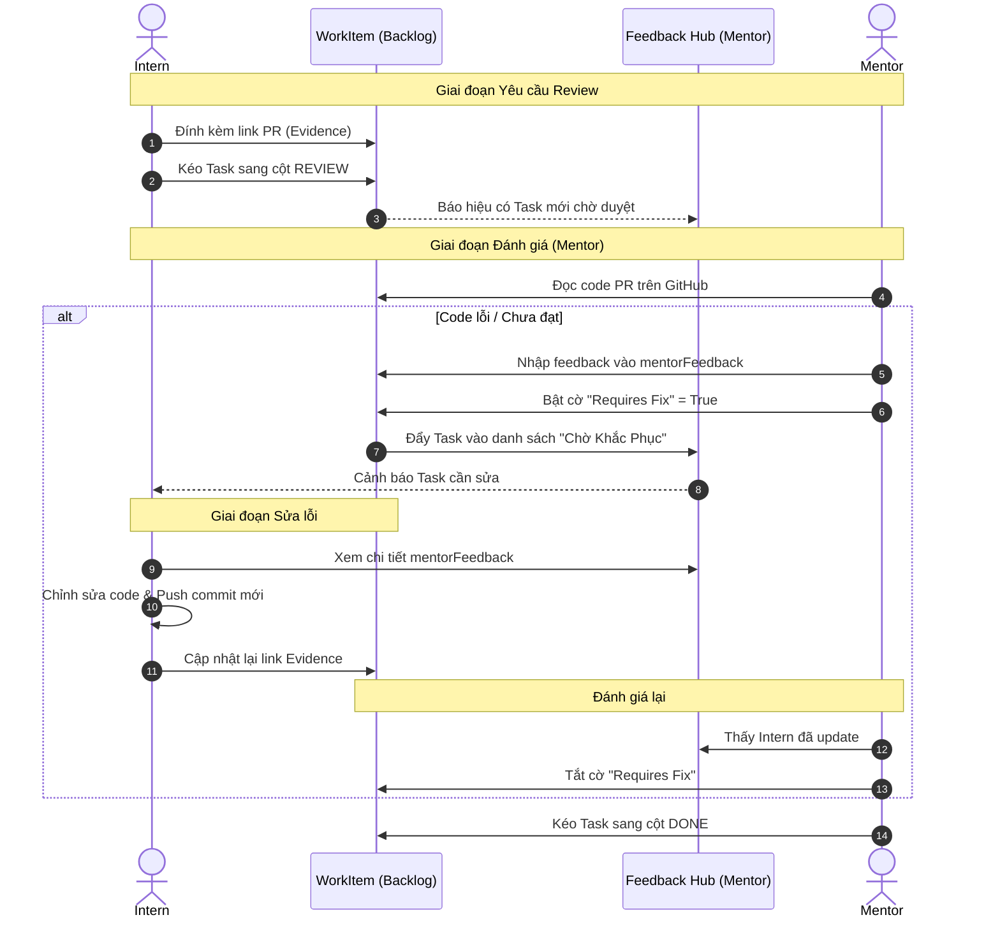

# 04. Đánh giá & Phản hồi từ Mentor (Evaluation & Feedback Loop)

## Tổng quan
Luồng đánh giá là trái tim của AIMS, giúp nâng cao chất lượng code và định hướng cho Intern thông qua vòng lặp phản hồi (Feedback Loop) khép kín. Việc đánh giá được phân bổ thành hai cấp độ chính: Vi mô (Từng Work Item) và Vĩ mô (Toàn bộ Sprint).

## Lộ trình Feedback Hub (Swimlane Flowchart)
Sơ đồ dưới đây trình bày chi tiết "vòng lặp vô tận" cho đến khi mã nguồn của Intern đạt yêu cầu hoàn toàn.

## 1. Đánh giá Vi mô (Micro-level: Work Item Review)
Khi Intern chuyển một Work Item sang trạng thái `REVIEW`, luồng đánh giá sẽ được kích hoạt.

### Luồng Xử lý Lỗi (Requires Fix Flow)
Đây là quy trình quản lý chất lượng khắt khe nhất của hệ thống:
1. Mentor kiểm tra PR (Pull Request) hoặc Evidence Link của Intern.
2. Nếu mã nguồn không đạt chuẩn, Mentor nhập phản hồi vào trường `mentorFeedback` trên Work Item đó.
3. Kích hoạt cờ `requiresFix = true`.
4. Work Item tự động xuất hiện tại **Trung tâm Phản hồi (Feedback Hub)** ở đường dẫn `/dashboard/mentor/feedbacks`.
5. Feedback Hub cho phép Mentor gom nhóm toàn bộ các công việc đang bị "bắt lỗi" ở mọi dự án vào một chỗ, dễ dàng giám sát xem Intern đã fix lỗi hay chưa mà không phải lặn lội tìm trong từng Backlog.

## 2. Đánh giá Vĩ mô (Macro-level: Sprint Review)
Sau 1-2 tuần chạy Sprint, Mentor và Intern sẽ tổ chức "Sprint Retrospective".
- Model `SprintReview` đảm nhận nhiệm vụ này.
- Các trường đánh giá chi tiết:
  - `goalResult`: Đánh giá mức độ đạt mục tiêu của Sprint.
  - `technicalFinds`: Các phát hiện/lỗi kỹ thuật phổ biến.
  - Kỹ thuật **KPT (Keep - Problem - Try)**:
    - `keep`: Những điểm tốt cần duy trì.
    - `problem`: Vấn đề gặp phải.
    - `tryItem`: Hành động cần thử nghiệm ở Sprint sau.
- Điểm đánh giá (`score`): Chấm điểm hiệu suất Sprint.
